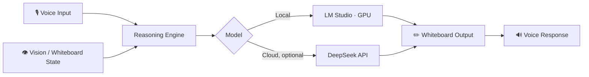

<div align="center">

# TeachAI

### The AI tutor that draws while it teaches.

**A live interactive whiteboard powered by voice, vision, and local or cloud LLMs — explaining any subject, in real time.**

<br/>

[](#license)
[](#requirements)
[](#-model-options)
[](#-model-options)
[](#roadmap)

<br/>

[Quick Start](#-quick-start) · [How It Works](#-how-it-works) · [Model Options](#-model-options) · [Roadmap](#-roadmap) · [Contributing](#-contributing)

</div>

<br/>

---

<br/>

## ✦ What is this

**TeachAI** is an open-source AI tutor that explains *any* subject on a live interactive whiteboard — combining voice, computer vision, and either a local LLM (via **LM Studio**) or a cloud model (via the **DeepSeek API**).

Instead of a wall of text, you get a teacher: something that draws, points, listens, and adapts — running entirely on your own machine if you want it to.

> [!NOTE]
> TeachAI ships with sensible defaults out of the box. No API keys, no cloud accounts, no configuration — just Python and your GPU.

<br/>

## ✦ Quick Start

**1. Clone the repository**

```bash
git clone https://github.com/your-org/teachai.git
cd teachai
```

**2. Install dependencies**

```bash
python paint_professor.py --install
```

This handles every dependency automatically — no manual `pip` wrangling.

**3. Run your teacher**

```bash
python paint_professor.py
```

That's it. TeachAI boots up using your GPU and a model pre-selected for this task — tuned to run smoothly without a cloud connection.

<br/>

<table>
<tr>
<td width="50%" valign="top">

### 🖥️ Local mode (default)

Runs fully offline on your own GPU through **LM Studio**.

- Zero setup, zero API keys
- Private — nothing leaves your machine
- Optimized for real-time whiteboard responses

</td>
<td width="50%" valign="top">

### ☁️ Cloud mode (optional)

Plug in a **DeepSeek API key** for a sharper, more capable teacher.

- Deeper, more nuanced explanations
- Same safety layer, smarter output
- Fully optional — local mode always works

</td>
</tr>
</table>

<br/>

## ✦ How It Works



Your voice and the current whiteboard state are fed into the reasoning engine, which routes to whichever model you've configured. The response comes back as both **drawn strokes on the whiteboard** and **spoken explanation** — a real teaching loop, not a chatbot with a canvas bolted on.

<br/>

## ✦ Model Options

> [!TIP]
> Start local. Only add a DeepSeek key once you feel the local model's ceiling.

| | Local (default) | Cloud (optional) |
|---|---|---|
| **Engine** | LM Studio, your GPU | DeepSeek API |
| **Setup** | None | API key |
| **Cost** | Free | Pay-per-use |
| **Privacy** | Fully offline | Requests sent to DeepSeek |
| **Explanation depth** | Solid, occasionally dry | Noticeably sharper |
| **Safeguards** | Built-in | Built-in |

<details>
<summary><strong>Why does the local model sometimes feel "dumb or dry"?</strong></summary>

<br/>

The default local model is deliberately small enough to run comfortably on consumer GPUs in real time. The built-in safety and reasoning layers keep it reliable and on-topic, but nuance is the first thing a smaller model trades away.

We're actively working on tightening the local experience — see the [Roadmap](#-roadmap). In the meantime, a DeepSeek API key closes most of the gap.

</details>

<br/>

## ✦ Requirements

- Python 3.10+
- A CUDA-capable GPU (recommended for local mode)
- [LM Studio](https://lmstudio.ai) installed, or a DeepSeek API key

<br/>

## ✦ Roadmap

- [ ] Smarter default prompting for the local model
- [ ] Multi-subject whiteboard memory (context across sessions)
- [ ] Improved vision grounding for handwritten input
- [ ] Additional local model presets by GPU tier

<br/>

## ✦ Contributing

Pull requests, issues, and ideas are all welcome. If you're improving the local model's explanations or the whiteboard/vision pipeline, that's exactly the kind of contribution this project needs most right now.

```bash
# fork, then:
git checkout -b feature/your-idea
git commit -m "Add: your idea"
git push origin feature/your-idea
```

<br/>

## ✦ License

Released under the **MIT License**. See [`LICENSE`](./LICENSE) for details.

<br/>

<div align="center">

**Built for anyone who learns better with a whiteboard than a wall of text.**

⭐ If TeachAI is useful to you, consider starring the repo — it helps others find it.

</div>
